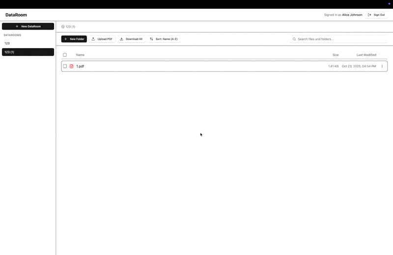

# DataBox

Link: https://databox-af6.pages.dev/ (used github action for testing and deployment to cloudflare)




So here's what I built for this demo:

## 1. Functional Requirements

### 1.1 File Operations

- Single or bulk upload
- Rename
- Zip or single-file download
- Move between folders and datarooms
- Drag-and-drop support
- Single or multi-delete with undo

### 1.2 Folder Operations

- Nested folder structure
- Drag-and-drop
- Move between datarooms

### 1.3 Context Actions

- Right-click menu and/or kebab (⋮) menu

### 1.4 File Preview

- Modal viewer

### 1.5 Recent Files

- List view with quick preview

### 1.6 Search & Sort

- Basic filters and ordering

### 1.7 Authentication

- Basic sign-in / sign-up form

### 1.8 Keyboard Shortcuts

- Common actions: rename, delete, undo, etc.

---

## 2. Non-Functional Requirements

### 2.1 Offline Mode

- PWA (Vite plugin) + IndexedDB (Dexie) maybe our client will find this useful in airplane mode :)

---

## 3. Core Architecture

### 3.1 Data Model (The core layer was a main focus for this task because the app's performance and UI integration depend on it.)

- **Normalized graph:** flat map of nodes (files/folders)
- Uses `parentId` / `childrenIds` for hierarchy
- **Benefits:** O(1) lookups, easy serialization, no circular references, cheap moves (pointer updates)

Here's what it looks like:

```typescript
// Normalized graph
{
  nodes: {
    "folder-1": {
      id: "folder-1",
      name: "Documents",
      type: "folder",
      parentId: null,
      childrenIds: ["folder-2", "file-1"]
    },
    "folder-2": {
      id: "folder-2",
      name: "Work",
      type: "folder",
      parentId: "folder-1",
      childrenIds: ["file-2"]
    },
    "file-1": {
      id: "file-1",
      name: "report.pdf",
      type: "file",
      parentId: "folder-1",
      size: 1024,
      content: Blob
    }
  },
  rootIds: ["folder-1"]
}
```

### 3.2 Storage Layer

- IndexedDB via Dexie
- Dependency injection for data layer (to swap with backend later)

### 3.3 React Service Layer

- **React Query** to integrate service layer (e.g., IndexedDB)
- Handles loading, error states, and synchronization

---

## 4. Performance

- `pdf.js` + Web Worker to avoid blocking the main thread with large files (since we use blob instead of URL)
- Added virtualization for file explorer list (no important for MVP and stiil ot sure how many files can be in the folder)

---

## 5. Authentication

- OIDC (mocked in development)
- Avoid vendor lock-in by not tying to a specific SDK

---

## 6. Error Handling

- Logger facade (Sentry / New Relic pluggable later)
- Handles broken files, size-limit errors, and rendering issues

---

## 8. Edge Cases

- **Long file names:** no hard validation; just truncate in UI
- **Corrupt or unreadable files:** show in preview error message about it

---

## 9. Testing

- **Core logic:** unit tests (`DataRoomCore`, `DexieDataRoomManager`) with plain TypeScript
- **UI:** Playwright I used just for development convenience. + manual edge-case testing with recordings

---

## 10. What’s Missing / TODO

- Permissions & sharing
- Tree-view sidebar (better than breadcrumbs for deep hierarchies in my opinion)
- Real auth provider (production OIDC issuer)
- Error monitoring (Sentry / New Relic)

## How to run in dev mode

- curl https://get.volta.sh | bash (optional but good to get the latest node version)
- pnpm install
- pnpm dev